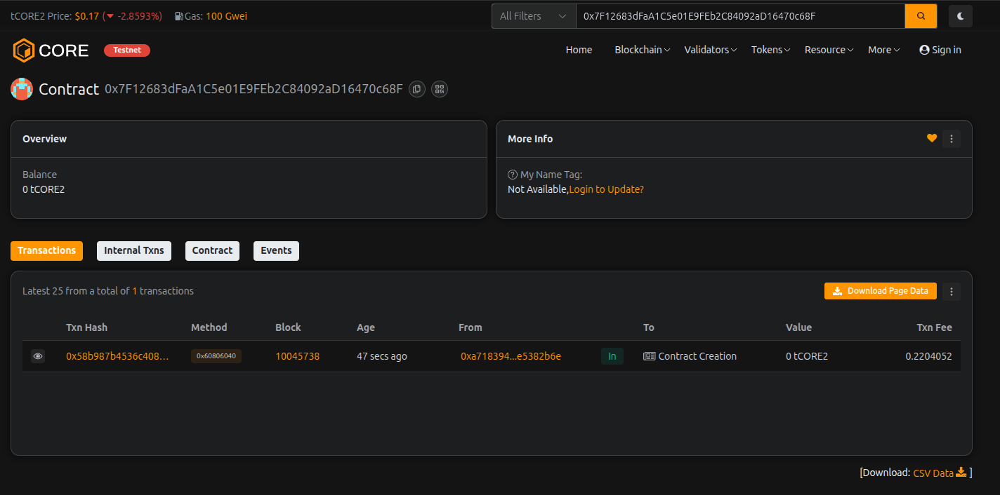

# GasLess Trade

## Project Description

GasLess Trade is a revolutionary blockchain-based trading platform that enables users to perform trades without paying gas fees directly. The smart contract implements meta-transactions using EIP-712 signatures, allowing authorized relayers to execute transactions on behalf of users while covering the gas costs. This creates a seamless trading experience where users can trade digital assets without needing ETH in their wallets for gas fees.

The platform provides a secure escrow system where users can deposit funds, create trades with specific buyers, and complete transactions with automated fee distribution. All trades are recorded on-chain, ensuring transparency and immutability.

## Project Vision

Our vision is to democratize blockchain trading by removing the barrier of gas fees, making cryptocurrency trading accessible to everyone regardless of their technical knowledge or ETH holdings. We aim to:

- **Eliminate Gas Fee Friction**: Enable users to trade without worrying about gas costs
- **Improve User Experience**: Provide a Web2-like experience on Web3 infrastructure
- **Increase Adoption**: Make blockchain trading accessible to mainstream users
- **Ensure Security**: Maintain the highest security standards through cryptographic signatures and smart contract auditing
- **Foster Decentralization**: Support multiple authorized relayers to prevent centralization

By implementing gasless transactions, we're paving the way for mass adoption of blockchain technology in everyday trading scenarios.

## Key Features

### Core Trading Features
- **Gasless Transactions**: Users can execute trades without paying gas fees directly through meta-transaction support
- **Secure Escrow System**: Funds are held securely in the smart contract until trades are completed
- **Peer-to-Peer Trading**: Direct trading between specified buyers and sellers
- **Automated Fee Distribution**: Platform fees are automatically calculated and distributed

### Meta-Transaction Infrastructure
- **EIP-712 Signature Support**: Industry-standard cryptographic signatures for secure transaction authorization
- **Nonce Management**: Prevents replay attacks through incremental nonce tracking
- **Authorized Relayers**: Multiple relayers can be authorized to execute meta-transactions
- **Signature Verification**: Built-in verification ensures only authorized transactions are executed

### User Management
- **Balance Tracking**: Individual user balances are tracked within the contract
- **Deposit & Withdrawal**: Easy fund management with deposit and withdrawal functions
- **Trade History**: Complete on-chain record of all trades with timestamps

### Administrative Controls
- **Owner Privileges**: Contract owner can manage relayers and adjust platform parameters
- **Dynamic Fee Structure**: Fee percentage can be adjusted based on market conditions
- **Relayer Authorization**: Flexible system for adding or removing authorized relayers

## Future Scope

### Enhanced Trading Features
- **Multi-Token Support**: Extend beyond ETH to support ERC-20 tokens and NFTs
- **Order Book System**: Implement a full order matching engine for market and limit orders
- **Automated Market Making**: Integrate AMM functionality for instant swaps
- **Batch Transactions**: Allow users to execute multiple trades in a single meta-transaction

### Advanced Meta-Transaction Capabilities
- **Gas Station Network Integration**: Connect with GSN for decentralized relayer network
- **Conditional Execution**: Support for time-locked and condition-based trades
- **Cross-Chain Trading**: Enable gasless trading across multiple blockchain networks
- **Mobile SDK**: Provide easy integration for mobile applications

### Security & Scalability
- **Multi-Signature Support**: Add multi-sig capabilities for high-value trades
- **Layer 2 Integration**: Deploy on L2 solutions for even lower costs
- **Insurance Pool**: Create a fund to protect users against smart contract vulnerabilities
- **Formal Verification**: Complete mathematical proof of contract correctness

### User Experience
- **Reputation System**: Build trust through trader ratings and history
- **Dispute Resolution**: Implement a decentralized arbitration system
- **Social Trading**: Allow users to follow and copy successful traders
- **Analytics Dashboard**: Provide comprehensive trading analytics and insights

### Ecosystem Development
- **Developer API**: RESTful API for easy integration with external platforms
- **Plugin System**: Allow third-party developers to extend functionality
- **Governance Token**: Implement DAO governance for platform decisions
- **Relayer Marketplace**: Create an open marketplace for relayer services with competitive pricing

## Deployment Guide

### Constructor Parameters

When deploying the GasLessTrade contract, you need to provide the `_feePercentage` parameter:

```solidity
GasLessTrade gaslessTrade = new GasLessTrade(100); // 1% fee
```

### Fee Percentage Values (in Basis Points)

The fee is calculated in **basis points** where 100 = 1%:

- **30** = 0.3% fee (very competitive, similar to Uniswap)
- **50** = 0.5% fee (low fee, great for high-volume trading)
- **100** = 1% fee (recommended - balanced and competitive)
- **250** = 2.5% fee (standard trading platform rate)
- **500** = 5% fee (premium service tier)
- **1000** = 10% fee (maximum allowed by contract)

**Recommended:** Deploy with `100` (1% fee) for a competitive and fair platform.

### Fee Calculation Example

For a trade of 1 ETH with 1% fee (100 basis points):
- Platform fee collected: 0.01 ETH
- Amount sent to buyer: 0.99 ETH

## Contract Details:

Transaction id: 0x7F12683dFaA1C5e01E9FEb2C84092aD16470c68F
